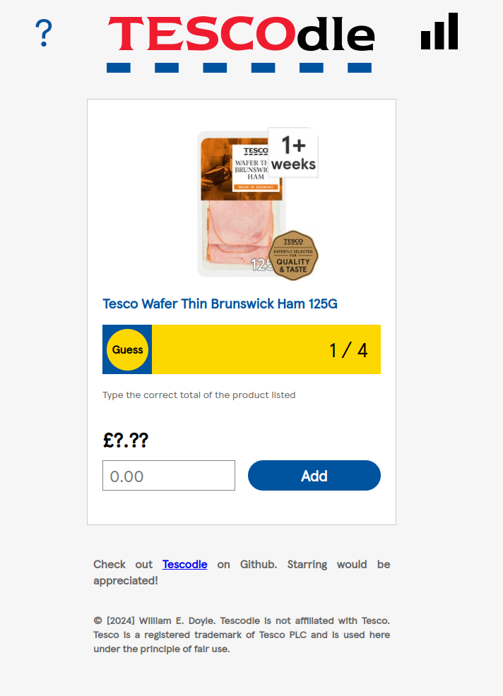
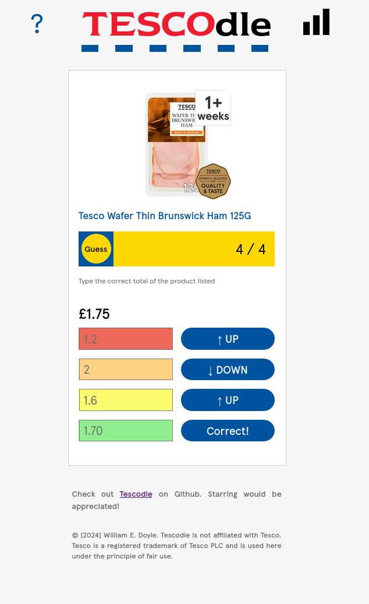
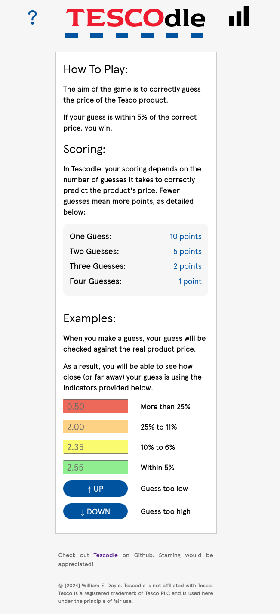
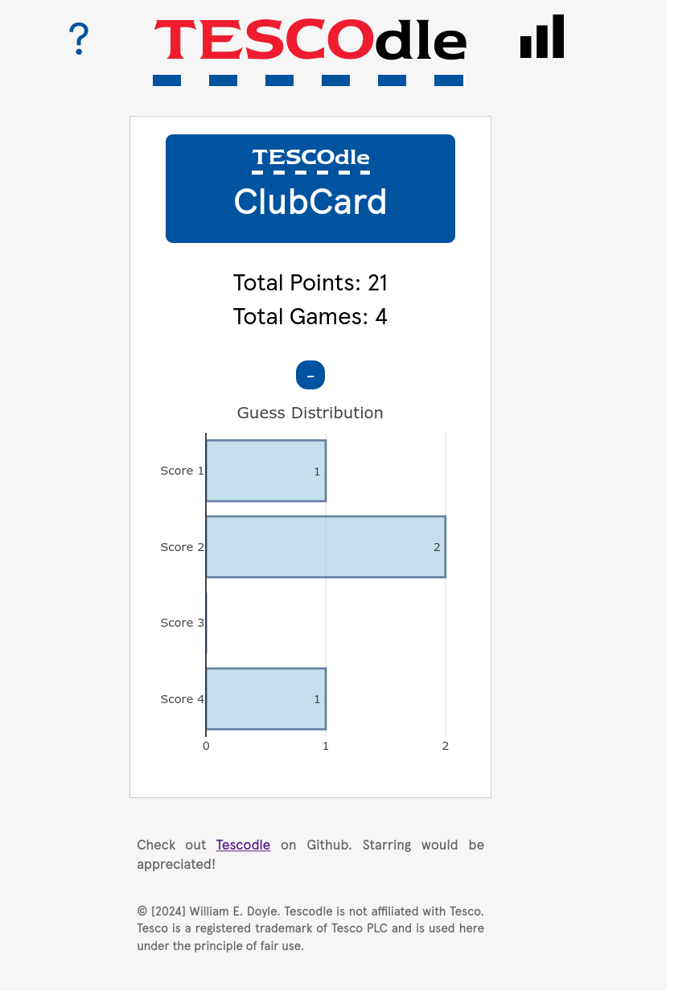

# TESCOdle

## About 

TESCOdle is an interactive web-based game inspired by wordle and costcodle. In this game, players are challenged with guessing the prices of products from Tesco. The game uses data scraped from Tesco using [tesco-webscraper](https://github.com/wdoyle123/tesco-webscraper.git). The game refreshes once per day offering users a daily guessing game.

<div align=center>

<div align=left>

## Demo

<details>
<summary>Feedback to User Input</summary>
<p>
TESCOdle provides feedback to user input in the form of colours and arrows to aid the user to find the correct product price.
</p>
<div align=center>

<div align=left>
</details>

<details>
<summary>Game Rules</summary>
<p>
TESCOdle provides rules that explain the game to new users.
</p>
<div align=center>

<div align=left>
</details>

<details>
<summary>Score Tracking and Graph</summary>
<p>
TESCOdle keeps track of the users' score and features a graph to show score distributions.
</p>
<div align=center>

<div align=left>
</details>


## Technical Features

TESCOdle's game functions are written in javascript and uses the users local storage on their browser to keep track of scores.

## Installation

To install TESCOdle on your local machine, follow these steps:

1. Clone the repository:

```
git clone https://github.com/wdoyle123/TESCOdle.git
```

2. Navigate to the cloned repository

```
cd TESCOdle
```

3. Start the local server

```
npm start # or python -m http.server
```

## Licence

See [LICENSE](LICENSE)

## Disclaimer

### No Affiliation with Tesco
"TESCOdle" is an independent project developed for educational and entertainment purposes. It is not affiliated with, endorsed by, sponsored by, or in any way officially connected with Tesco plc or any of its subsidiaries or affiliates. The official Tesco website can be found at www.tesco.com.

### Use of Trademarks
All trademarks, service marks, trade names, trade dress, product names, and logos appearing in this project are the property of their respective owners. Any rights not expressly granted herein are reserved. The use of Tesco's trademarks in this project is for descriptive purposes only and does not imply any endorsement by Tesco.

### Data Usage
This project may use data sourced from Tesco for demonstration purposes. The data is used under fair use policy and is not intended for commercial exploitation or to infringe on Tesco's rights. This project does not monetise any data belonging to Tesco.

### No Warranty
This project is provided "as is", without warranty of any kind, express or implied. The developers of "TESCOdle" assume no responsibility for errors or omissions in the contents of the project.

## Acknowledgements

- My friend Henry, for suggesting an adaption of Costcodle to suit a British audience.

- Kerm, for his work on [Costcodle](https://github.com/KermWasTaken/costcodle) from which inspired TESCOdle.

- Tesco, for obvious reasons!
